<div align="center">

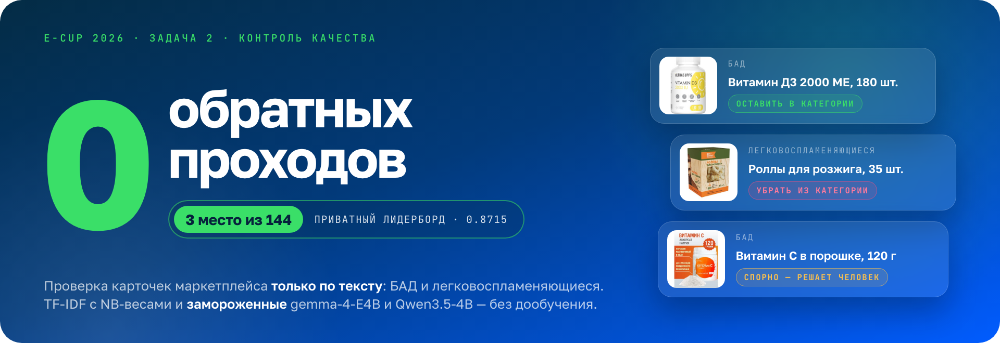

<br>

<a href="https://ods.ai/competitions/e-cup-2026-quality/leaderboard"></a>   <a href="https://osandreev.github.io/quality_test_page/"></a>

**[📑 Презентация](docs/presentation.pdf)** · **[🖥 Демо](https://osandreev.github.io/quality_test_page/)** · **[⚙️ Код решения](submit/run.py)** · **[🏁 Соревнование](https://ods.ai/competitions/e-cup-2026-quality)**

</div>

<br>

Решение задачи 2 «Контроль качества» соревнования **E-CUP 2026** от Ozon Tech и ODS. По карточке товара — названию, описанию и фотографиям — нужно решить, относится ли товар к категории **БАД** или **легковоспламеняющиеся (ЛВ)**, и объяснить решение проверяющему.

Решение смотрит **только на текст** и **не дообучает ни одной нейросети**. БАД закрывает TF-IDF с NB-взвешиванием признаков и логистической регрессией. ЛВ — стек текстовых каналов и замороженных gemma-4-E4B и Qwen3.5-4B, которым в промпт подкладываются похожие размеченные товары. Итог — **3 место из 144** на приватном лидерборде.

| 🥉 3 / 144 | 0.8715 | 0 | 700+ |
|:---:|:---:|:---:|:---:|
| место на приватном лидерборде | приватный скор — 0.0009 от первого места | обратных проходов: языковые модели заморожены | экспериментов, в каждом одно изменение |

**Содержание:** [Демо](#демо) · [Результат](#результат) · [Презентация](#презентация) · [Как устроено решение](#как-устроено-решение) · [Запуск](#запуск) · [Состав репозитория](#состав-репозитория)

## Демо

<a href="https://osandreev.github.io/quality_test_page/">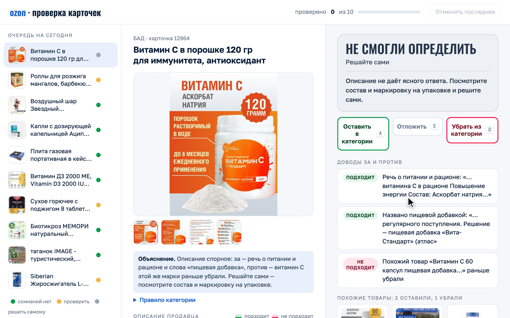</a>

Прототип рабочего места проверяющего на настоящих карточках из датасета. Наверху одно решение, под ним доводы за и против целыми фразами, в описании продавца подсвечены фразы, которые сдвинули решение, справа — похожие товары и то, что по ним решили раньше. Если модель не уверена, решает человек — как в первой карточке ролика.

**[Открыть демо →](https://osandreev.github.io/quality_test_page/)** · клавиши `A` оставить, `S` отложить, `D` убрать, `Ctrl+Z` отменить

> [!NOTE]
> Прототип собран к защите финала и в отправленный контейнер не входил: там комментарий к вердикту — шаблон по категории и решению. Качество объяснений на лидерборде не оценивалось, его смотрело жюри на защите.

## Результат

| Место | Public | Private |
|:---:|:---:|:---:|
| 1 | 0.9114 | 0.8724 |
| 2 | 0.9042 | 0.8718 |
| 🥉 **3 — это решение** | **0.8362** | **0.8715** |
| 4 | 0.8829 | 0.8679 |
| 5 | 0.7754 | 0.8676 |

По зондам лидерборда, в публичной части было около 700 карточек ЛВ и всего 24 позитива: одна карточка сдвигала итоговую метрику примерно на 0.015. Поэтому ни одно решение не принималось по паблику — только по собственной локальной валидации. На паблике решение было четвёртым из этой пятёрки, а на привате вся пятёрка уместилась в 0.0048 — меньше цены одной карточки ЛВ (≈ 0.0086). От первого места решение отделяют 0.0009, примерно 2.6 карточки БАД.

## Презентация

Слайды с защиты финала — 16 штук. Целиком: **[docs/presentation.pdf](docs/presentation.pdf)**. Ниже те же слайды по главам, с короткими комментариями.

<p align="center">
<a href="docs/slides/01-title.jpg">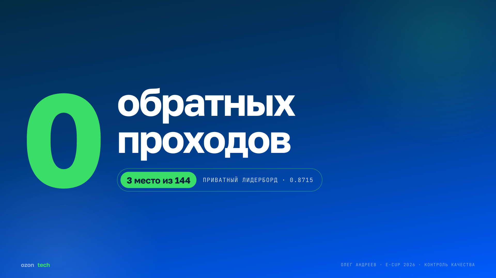</a>
<a href="docs/slides/02-author.jpg">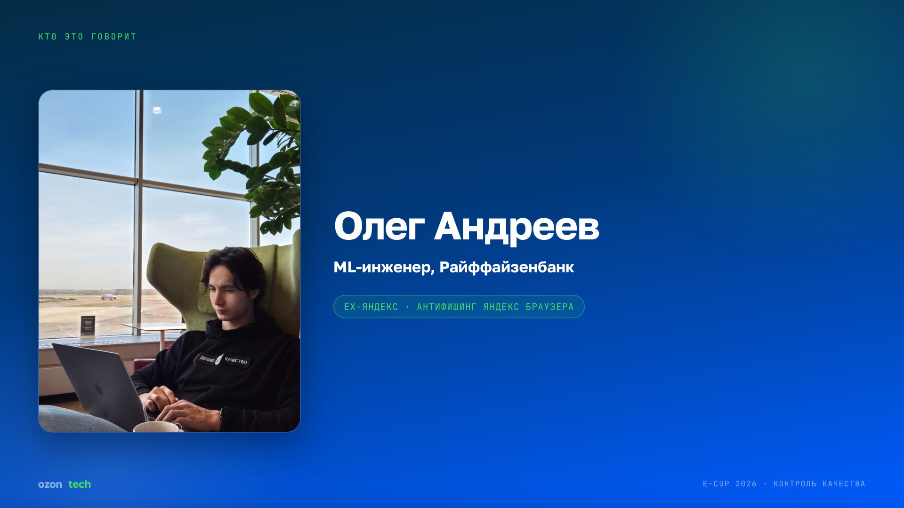</a>
<a href="docs/slides/03-findings.jpg">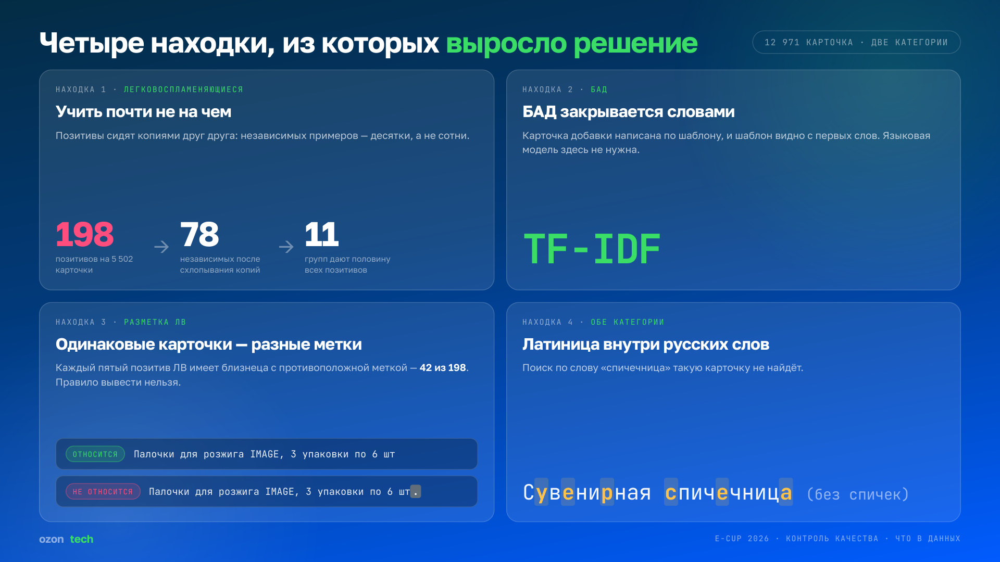</a>
<a href="docs/slides/04-traps.jpg">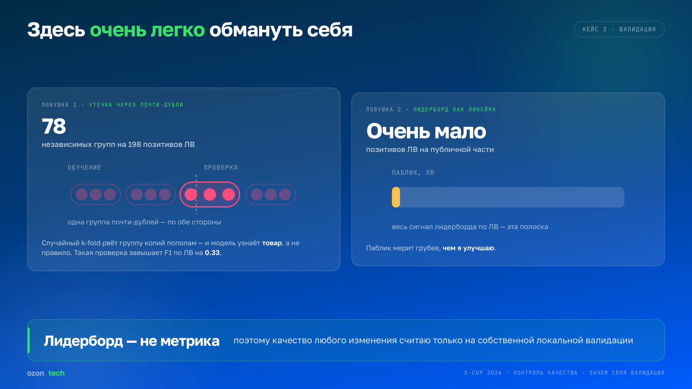</a>
<a href="docs/slides/05-validation.jpg">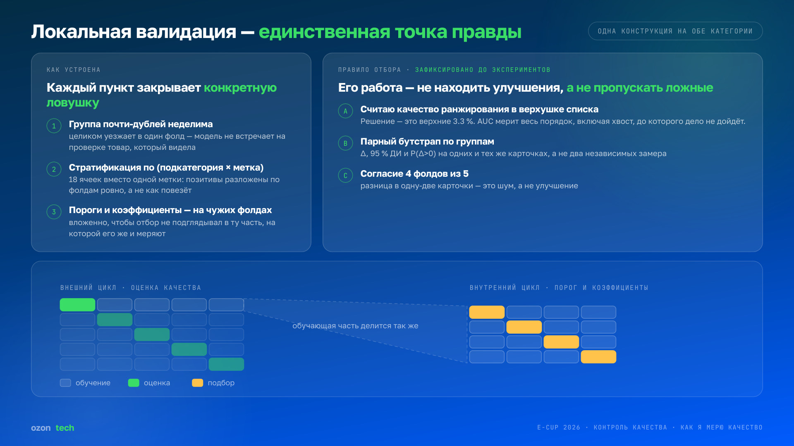</a>
<a href="docs/slides/06-result.jpg">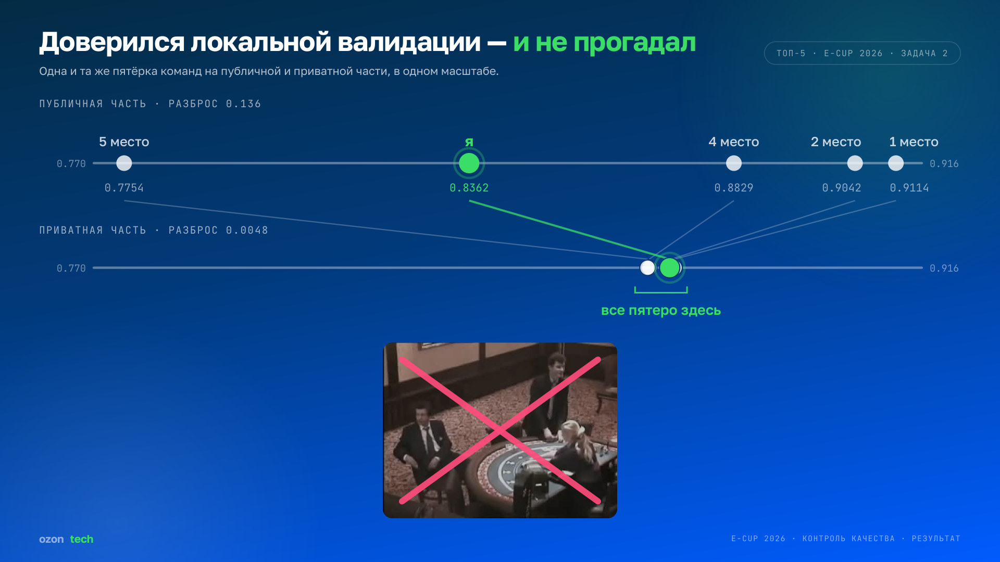</a>
<a href="docs/slides/07-ladder.jpg">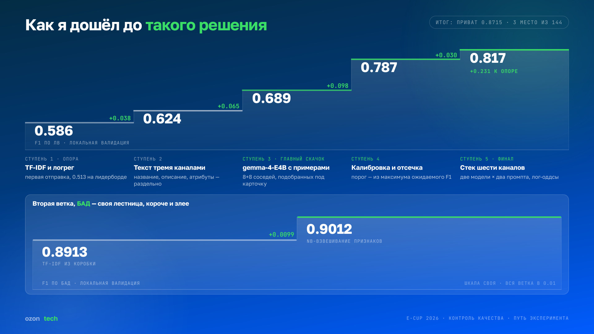</a>
<a href="docs/slides/08-experiments.jpg">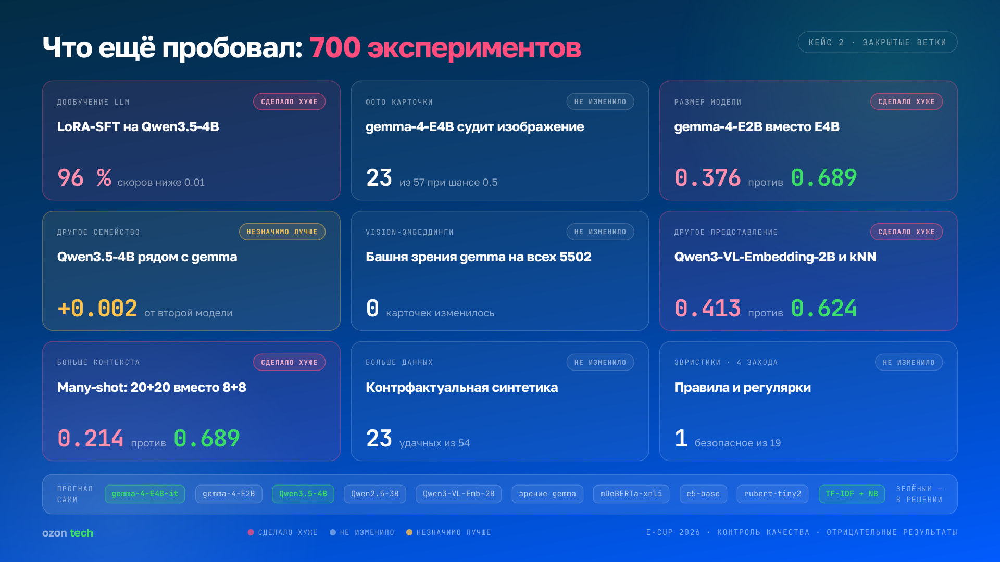</a>
<a href="docs/slides/09-arch-verdict.jpg">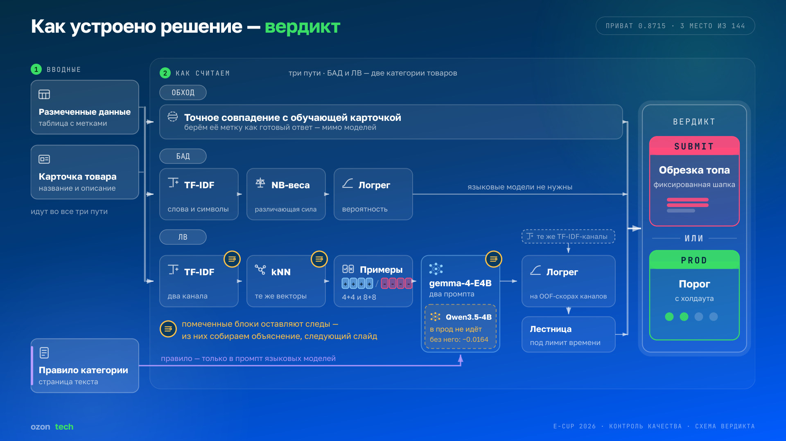</a>
<a href="docs/slides/10-arch-explain.jpg">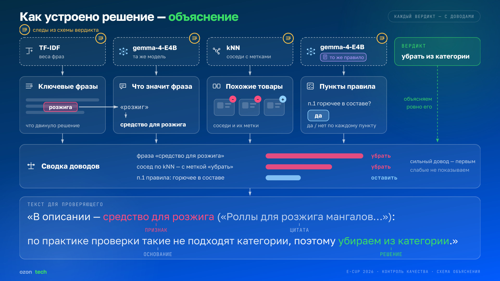</a>
<a href="docs/slides/11-prompt.jpg">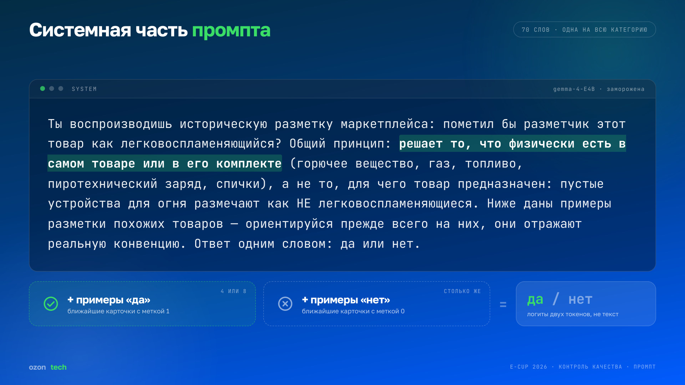</a>
<a href="docs/slides/12-no-photos.jpg">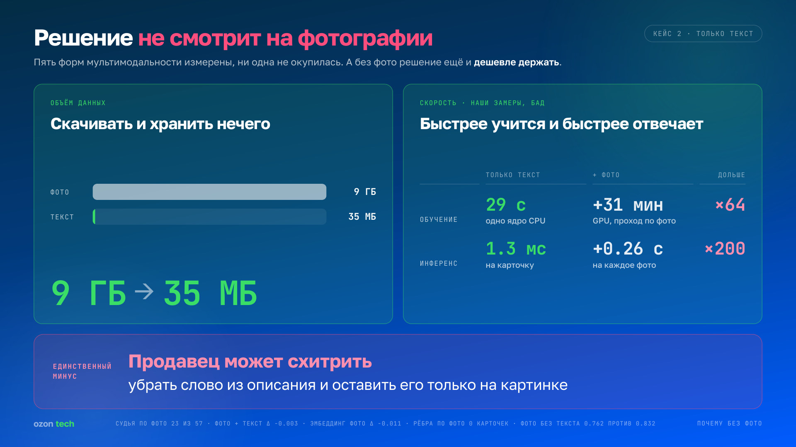</a>
<a href="docs/slides/13-cost.jpg">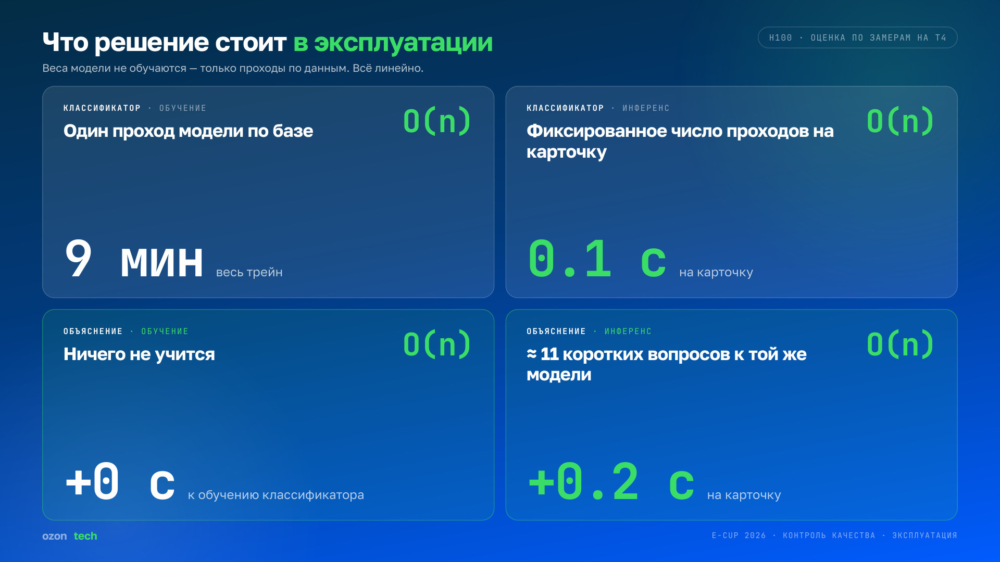</a>
<a href="docs/slides/14-explain-quality.jpg">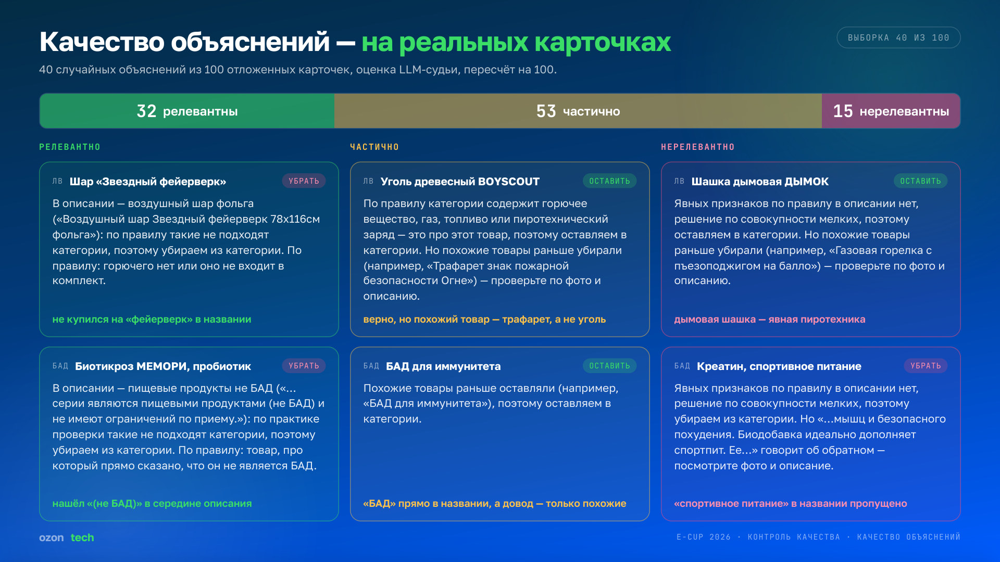</a>
<a href="docs/slides/15-operator.jpg">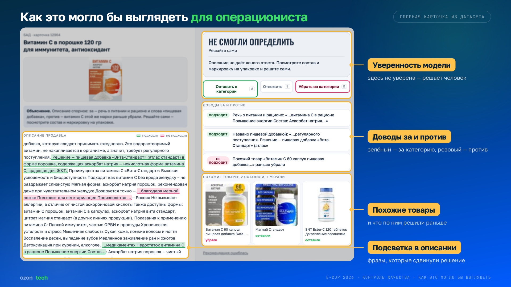</a>
<a href="docs/slides/16-thanks.jpg">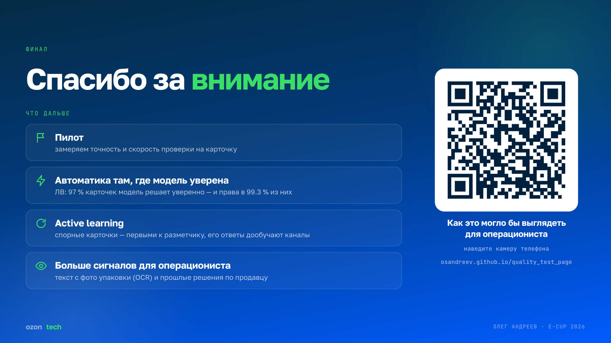</a>
</p>

### Данные


ЛВ — это 198 позитивов на 5 502 карточки, и почти все они копии друг друга: независимых примеров 78, а половину позитивов дают 11 групп. БАД, наоборот, написан по шаблону, и шаблон виден с первых слов — языковая модель там не нужна. Каждый пятый позитив ЛВ имеет близнеца с противоположной меткой, так что правило из разметки не выводится — только прецедент.


Случайный k-fold разрезает группы копий: модель узнаёт товар, а не правило, и F1 по ЛВ завышается на 0.33. Паблик же меряет ЛВ по двум десяткам позитивов — грубее, чем любое улучшение.

### Валидация


Пять фолдов; группа почти-дублей целиком уезжает в один фолд; стратификация по подкатегории и метке; пороги и коэффициенты подбираются вложенно, на чужих фолдах. Правило отбора зафиксировано до экспериментов: точность в верхних 3.3 % списка вместо AUC, парный бутстрап по группам и согласие четырёх фолдов из пяти.


Та же пятёрка на паблике и на привате в одном масштабе: разброс 0.136 сжался до 0.0048.

### Путь к решению


F1 по ЛВ на локальной валидации: 0.586 у TF-IDF с логрегом → 0.689 после gemma-4-E4B с 8 + 8 подобранными примерами → 0.817 у стека шести каналов. В БАД вся лестница умещается в 0.01: NB-взвешивание признаков дало +0.0099.


Отрицательные результаты — с цифрами. LoRA-дообучение запоминало бренды, фото через gemma ничего не изменили, мультимодальные эмбеддинги сделали хуже, длинный контекст (20 + 20 примеров) ломал 4B-модель, а из девятнадцати правил-регулярок безопасным оказалось одно.

### Устройство


Три пути. Точное совпадение с обучающей карточкой сразу отдаёт её метку. БАД: TF-IDF → NB-веса → логрег, без языковых моделей. ЛВ: TF-IDF и kNN-примеры → gemma-4-E4B с двумя промптами → логрег на OOF-скорах → лестница под лимит времени. Qwen3.5-4B есть в отправленном контейнере, но в эксплуатации не нужна: без неё −0.0164. Отсечка в соревновании — по доле выдачи, в эксплуатации — фиксированный порог с отложенной выборки.


Объяснение собирается из следов, которые вердикт уже оставил: веса фраз в TF-IDF, смысл фразы от той же gemma, соседи из kNN с их метками и пункты правила как вопросы «да / нет». Сильный довод идёт первым, слабые не показываются.


Одна системная часть на всю категорию — 70 слов, дальше ближайшие примеры «да» и «нет». Модель ничего не генерирует: ответ — логиты двух токенов.

### Эксплуатация


Пять форм мультимодальности измерены, ни одна не окупилась. Без фото данных в 260 раз меньше, модель БАД обучается за 29 секунд на одном ядре CPU и отвечает за 1.3 мс на карточку. Минус один: продавец может убрать слово из описания и оставить его только на картинке.


Веса не обучаются, есть только проходы по данным, поэтому всё линейно по числу карточек. Оценка для H100 по замерам на T4: обучение на всём трейне ≈ 9 минут, вердикт ≈ 0.1 с на карточку, объяснение — ещё ≈ 0.2 с.

### Объяснения


Честный замер: 40 случайных объяснений из 100 отложенных карточек, оценка LLM-судьи. Релевантны 32 %, частично — 53 %, нерелевантны 15 %; на слайде — удачи и провалы с разбором.


Спорная карточка из датасета глазами проверяющего: уверенность модели, доводы за и против, похожие товары, подсветка в описании. Эта же карточка открывается первой в [демо](https://osandreev.github.io/quality_test_page/).

### Что дальше


Пилот с замером скорости проверки; автоматика там, где модель уверена (в ЛВ это 97 % карточек при точности 99.3 %); active learning на спорных карточках; новые сигналы для проверяющего — текст с фото упаковки и история продавца.

## Как устроено решение

Контейнер на каждом запуске обучает модели с нуля на `train_data.csv` — сохранённых весов нет — и размечает тест. Языковые модели используются как есть, из `/shared_models`.

### БАД — только текст, CPU

| Шаг | Что делается |
|---|---|
| признаки | TF-IDF по склейке названия и описания: словесные 1–2-граммы (`min_df=2`, до 200k) и символьные `char_wb` 3–5-граммы (`min_df=3`, до 300k), `sublinear_tf` |
| NB-веса | каждый признак умножается на модуль логарифма отношения его частот в классах (только по трейну, нормировано к среднему 1): различающие признаки получают более слабый эффективный L2-штраф. +0.0099 F1 на локальной валидации, выбрано во всех 5 фолдах; перестановка тех же весов по случайным признакам даёт зеркальный минус |
| модель | логистическая регрессия: `liblinear`, `C=4`, `class_weight="balanced"` |
| вердикт | «не бан» получают верхние 62.8 % карточек по вероятности |

Доля выдачи задана константой `BAD_RATE = 578/921 = 0.6276`. Значение не подбиралось перебором: оно возникло в одной из ранних отправок как следствие её собственного правила отсечки и оказалось лучшим из наблюдавшихся по результатам отправок, после чего было зафиксировано.

### ЛВ — текст и замороженные LLM, GPU

Шесть каналов, каждый оценивает вероятность того, что товар легковоспламеняющийся:

| Канал | Модель | Что видит |
|---|---|---|
| `attr` | TF-IDF + логрег | три поля: полный текст, атрибутная выжимка (комплектация, состав, топливо, баллон…), название |
| `tfidf` | TF-IDF + логрег | полный текст |
| `gemret` | gemma-4-E4B-it | 4 ближайших размеченных «да», 4 «нет» и сам товар |
| `ret8` | gemma-4-E4B-it | то же, 8 + 8 |
| `qret` | Qwen3.5-4B | тот же промпт 4 + 4 |
| `few` | Qwen3.5-4B | инструкция подкатегории (газ, розжиг, пиротехника, спички…) и 6–12 фиксированных примеров |

- **Примеры для промпта** — kNN по символьному TF-IDF (`char_wb` 3–5) среди трейна, не больше одной карточки на группу почти-дублей, чтобы в промпт не попадали копии одного товара.
- **Скор LLM без генерации:** один прямой проход, `logsumexp` логитов вариантов «да» минус «нет» на первом токене ответа.
- **Стек:** логистическая комбинация лог-оддсов каналов с коэффициентами, снятыми с OOF-предсказаний (`params.json`).
- **Лестница деградации:** коэффициенты зашиты для каждого подмножества каналов. Если стадия не успела к своему дедлайну (gemma — 9 минут, Qwen — 16 при лимите 20), стек берёт набор под то, что посчиталось; без GPU остаются два текстовых канала.
- **Вердикт:** число «не бан» выбирается максимизацией ожидаемого F1 по вероятностям стека, отсортированным по убыванию:

  ```math
  k^{*} = \arg\max_k \frac{2\sum_{i \le k} p_{(i)}}{k + \sum_i p_i}
  ```

### Общее для обеих категорий

- Если название и описание точно совпадают с карточкой из трейна, берётся метка большинства её дублей — поверх моделей.
- Комментарий к вердикту — шаблон по категории и решению: формат требует 50–300 символов, а качество объяснений на лидерборде не оценивалось.

## Запуск

```bash
python submit/run.py --test_data_path test.csv --output_path submit.csv
```

- Образ `odsai/ecup26-quality-baseline:1.0`, точка входа описана в `submit/metadata.json`.
- Модели читаются из `/shared_models` (путь меняется переменной `SHARED_MODELS_PATH`), интернет не нужен.
- Без GPU контейнер детерминированно переходит на текстовый стек.
- На выходе CSV с колонками `id` и `result`, где `result` — `<комментарий>…<вердикт>бан` или `<комментарий>…<вердикт>не бан`.

## Состав репозитория

```
submit/                          содержимое отправленного архива, побайтово
  run.py                         точка входа контейнера
  prompts.py                     промпты LLM-стадий
  params.json                    коэффициенты стека ЛВ для каждой ступени лестницы
  fewshot_submit.json            примеры для few-shot по подкатегориям (из трейна)
  lv_groups.json                 группы почти-дублей ЛВ (из трейна)
  train_data.csv                 трейн, предоставленный организаторами
  metadata.json                  образ и точка входа
artifacts/
  EXP-188_nbsub_submission.zip   отправленный архив целиком
docs/
  presentation.pdf               презентация с защиты финала
  slides/                        слайды картинками
  assets/                        баннер, демо, превью для соцсетей
```

## Воспроизводимость

Сиды зафиксированы (`SEED=42`, `random_state=42` во всех оценщиках). Внешние данные не используются: единственный источник — `train_data.csv` из задачи. Модели — `gemma-4-E4B-it` и `Qwen3.5-4B`, обе из рекомендованного списка, до 4B.

## Связанные репозитории

- [**ozon_e-cup_2026_2**](https://github.com/OSAndreev/ozon_e-cup_2026_2) — вторая финальная отправка, EXP-751: те же модели, другая доля выдачи БАД на больших входах и дедлайны LLM-стадий, пропорциональные размеру входа. Место и скор 0.8715 получены отправкой EXP-188 из этого репозитория.
- [**quality_test_page**](https://github.com/OSAndreev/quality_test_page) — исходник демо рабочего места проверяющего на GitHub Pages.

## Автор


**Олег Андреев** · [@OSAndreev](https://github.com/OSAndreev)

<details>
<summary><b>In English</b></summary>

<br>

**3rd place of 144** in E-CUP 2026, Task 2 “Quality control” (Ozon Tech × ODS): moderation of marketplace product cards in two categories — dietary supplements (БАД) and flammable goods (ЛВ).

The solution reads **text only** and **trains no neural network**:

- *Supplements:* TF-IDF (word 1–2-grams and char 3–5-grams) with NB feature weighting and logistic regression.
- *Flammables:* a stack of two TF-IDF channels and four frozen-LLM channels — gemma-4-E4B-it and Qwen3.5-4B prompted with retrieved labelled neighbours. The score is the logit of “yes” vs “no”: no generation, no fine-tuning. Stack coefficients are pre-fit for every subset of channels, so the container degrades gracefully under the time limit.
- Decision: expected-F1 maximisation over the stacked probabilities.

Private LB **0.8715** (1st place: 0.8724). Slides are in Russian — [PDF](docs/presentation.pdf); the reviewer workstation demo is [here](https://osandreev.github.io/quality_test_page/).

</details>
